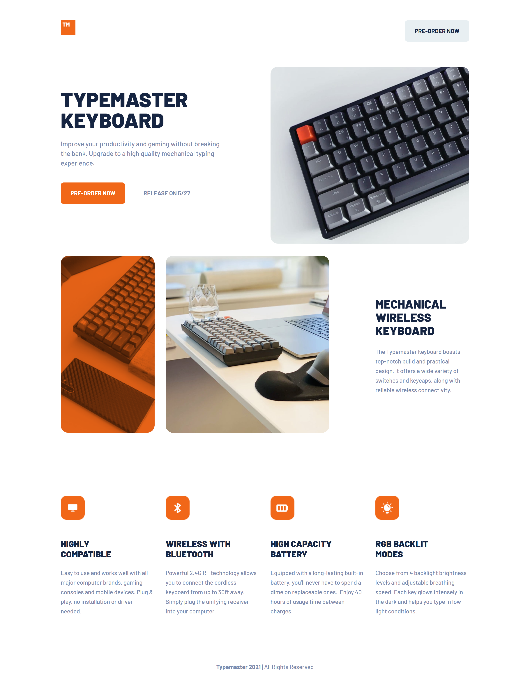

# Frontend Mentor - Typemaster pre-launch landing page solution

This is a solution to the [Typemaster pre-launch landing page challenge on Frontend Mentor](). Frontend Mentor challenges help you improve your coding skills by building realistic projects.

## The challenge

Users should be able to:

- View the optimal layout for the site depending on their device's screen size
- See hover states 

### Screenshot

### Links

- Live Site URL: [Typemaster pre-launch landing page](https://testerium-typemaster-landing-page.netlify.app/)

## My process

The project took me about 8 hours to complete. It is responsive - desktop, tablet and mobile versions.

### Built with

- HTML
- CSS 
- SCSS
- Grid
- Flexbox

## Author

- Frontend Mentor - [@testerium](https://www.frontendmentor.io/profile/testerium)
